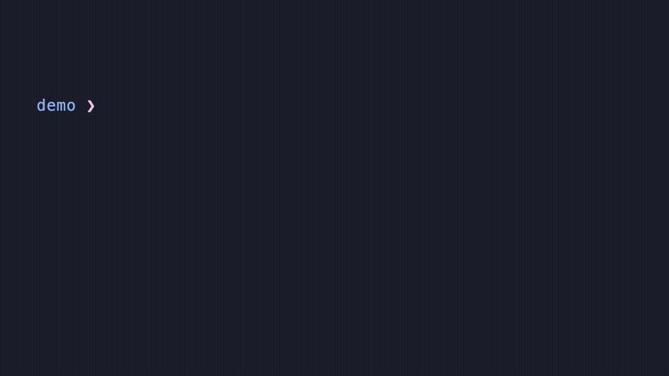

# jev-shell-history

Fish-style autosuggestions for zsh, ranked by [Jev](https://typesafe.ai)
(TypeSafe). As you type, the plugin looks at your last 100 distinct history
entries and asks Jev which one you are most likely completing. The best match is
shown in grey after the cursor, with its score; press → (or `^E` / End) to
accept it.



```
% git st▌atus  [0.970]                        ← prefix mode: literal completion
% last 5 commits▌  ⇢ git log --oneline -5  [1.000]  ← replace mode: no entry starts with the input
```

(The demo runs against a fabricated history; regenerate it with
`demo/make-demo.sh`, which needs `vhs`, `ffmpeg` and `TYPESAFE_API_KEY`.)

## Install

Requirements: zsh 5.9+, Node 22+ (runs the TypeScript directly), a TypeSafe API
key.

```sh
git clone <this repo> ~/.zsh/jev-shell-history
cd ~/.zsh/jev-shell-history && npm install
```

In `~/.zshrc`:

```zsh
export TYPESAFE_API_KEY=...
source ~/.zsh/jev-shell-history/zsh/jev-shell-history.plugin.zsh
```

Suggestions are accepted by `forward-char`, `vi-forward-char`, `end-of-line`
and `vi-end-of-line` when the cursor is at the end of the line, so → and `^E`
work in both emacs and vi keymaps (in vi mode, bind `^E` to `end-of-line` if
you want it there). There is also a standalone widget, `jev-accept-suggestion`,
for a custom binding.

### Configuration

Set before sourcing the plugin:

| Variable            | Default | Meaning                                                             |
| ------------------- | ------- | ------------------------------------------------------------------- |
| `JEV_HISTORY_LIMIT` | `100`   | Recent distinct commands to consider                                |
| `JEV_MIN_CHARS`     | `2`     | Do nothing until this many characters are typed                     |
| `JEV_THRESHOLD`     | `0.5`   | Fuzzy mode: min probability that *some* entry completes the input   |
| `JEV_MIN_SCORE`     | `0.3`   | Fuzzy mode: min probability of the top candidate                    |
| `JEV_STRONG_SCORE`  | `0.9`   | Fuzzy mode: a top score this high overrides `JEV_THRESHOLD`         |
| `JEV_HIGHLIGHT`     | `fg=8`  | zle highlight spec for the suggestion                               |
| `JEV_SHOW_SCORE`    | `1`     | Append the score, e.g. `[0.87]`                                     |
| `JEV_NODE`          | `node`  | Node binary                                                         |
| `JEV_MODEL`         | *(SDK default, `jev-latest`)* | TypeSafe model                                |
| `JEV_DEBUG_LOG`     | *(unset)* | When set, every request/response is appended to this file         |

## How it works

`zsh/jev-shell-history.plugin.zsh` hooks `line-pre-redraw`. On every buffer
change it kills any in-flight request and starts `src/cli.ts` in the background
(`zle -F` on a process-substitution fd, so the prompt never blocks). The result
is applied only if the buffer is still what was typed when the request started.

`src/cli.ts` does one TypeSafe request per keystroke:

1. **Candidates.** The last `--limit` distinct commands are read from the
   history file (extended format, multi-line entries supported). If any of them
   literally start with the typed text, only those are sent (*prefix mode*);
   otherwise all of them are (*fuzzy mode*). A single prefix match is suggested
   immediately without a request.
2. **One request, two questions.** The state holds `typed_so_far` and the
   candidates as an ID-tagged list. A `Choice` over the IDs asks which one the
   user is completing (score = its probability); a `Noul` asks whether *any*
   candidate completes the input.
3. **Gate.** Prefix mode always suggests the top candidate. Fuzzy mode suggests
   only when the top score ≥ `--min-score` and either the Noul ≥ `--threshold`
   or the top score ≥ `--strong-score`. The two signals fail in different places
   (the Noul under-fires on tiny histories where the Choice is decisive; on
   nonsense the Choice spreads out while the Noul is near zero), so both are
   used.

Exact rules — prefix matching, dedup, thresholds — live in code; Jev only does
the judgment call. Latency is roughly 0.7–0.9 s per request, almost all of it
API time (Node startup and history parsing are ~0.1 s).

## CLI

```
node src/cli.ts --buffer 'git ch' --list        # show the ranked candidates
node src/cli.ts --buffer 'git ch' --json        # full result incl. usage
node src/cli.ts --buffer 'git ch' --jev-only    # skip the prefix filter
node src/cli.ts --help
```

## Tests

```sh
npm test              # unit tests (history parsing, request shape, gating)
npm run typecheck
npm run test:e2e      # drives a real zsh in a pty; needs TYPESAFE_API_KEY
```

The e2e test types into an interactive `zsh -f` with a throwaway history file
and checks that suggestions appear, that typing along a suggestion does not
re-request, that → and `^E` accept and run the command (in emacs and vi
keymaps), that nonsense yields nothing, and that a stale response is discarded
when the buffer changes mid-request.
